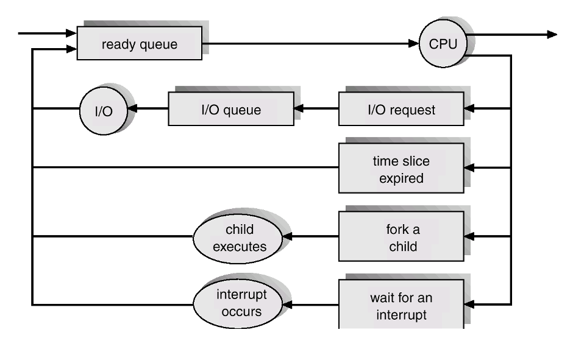

# Process Scheduling

**Scheduling**은 특정 행위를 하기 위해 정해진 규칙에 따라 특정 대상을 선택하는 것을 의미한다.

## Scheduling Queues

- **ready queue** : 프로세스가 만들어지고 시스템 상으로 들어가면 `ready queue`에 들어간다. 프로세스는 이곳에서 CPU-core를 할당받기를 기다린다. 
- **wait queue** : 특정 프로세스를 실행중에 I/O가 발생하면 그 프로세스는 `wait queue`에서 I/O interrupt가 발생하기를 기다린다.

> **NOTE** processor 와 disk 사이의 속도차이가 어마어마하기 때문에 I/O가 종료되기를 기다리는 것보다 다른 프로세스에게 CPU-core를 할당한다.

> **NOTE** Queue head가 첫번째 프로세스와 매핑되는 PCB를 가리킨다. 그리고 PCB들은 다음 PCB를 가리키는 포인터를 가진다. 대게 LinkedList 형태로 연결된다.

Process Scheduling은 ready queue와 여러 종류의 wait queue로 구성된다고 말할 수 있다.

- I/O request 가 발생하면 I/O wait queue
- child process를 생성하면 child terminated wait queue
- interrupt 발생으로 CPU-core를 강제로 뺏기거나 정해진 CPU사용시간을 초과하면 ready queue

## Scheduler

- **short-term scheduler(CPU-scheduler)** : 프로세스를 선택해서 CPU-core를 할당하는 스케쥴러. 글자 그대로 자주 발생한다.
- **long-term scheduler(Job-scheduler)** : 새로 만들어진 프로세스를 시스템으로 가지고 오는 스케쥴러 (new -> ready). 글자 그대로 자주 발생하지 않는다.
- **medium-term scheduler** : 프로그램들을 메모리 상으로 가지고 와서 실행할 때 메모리 공간이 부족한 경우 메모리 공간확보를 위해 디스크로 보낼 프로그램을 선택하거나 (**swap out**) 새로 생긴 공간에 가지고 올 프로세스를 선택하는 (**swap in**) 스케쥴러

> **NOTE** Swap-Out의 대상은 주로 일시중지된 프로세스이다

**degree of multiprogramming** : 메모리상에 올라와있는 프로그램의 개수