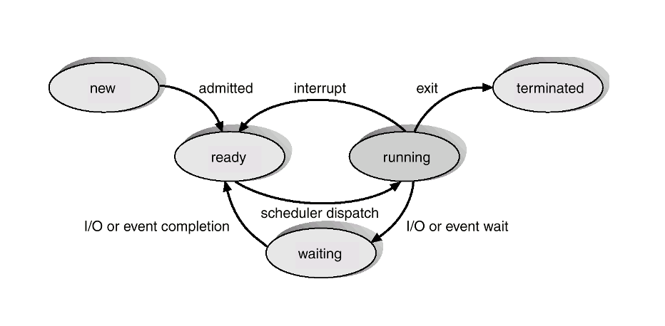

# 프로세스

프로세스의 2가지 의미
- 실행중인 프로그램
- 프로그램 실행에 필요한 모든 데이터를 담고 있는 자료구조

**프로그램과 프로세스는 다르다**
프로그램은 단순 코드들의 집합이면 (excutable file) 프로세스는 코드를 실행할 때 필요한 것들을(PC, Registers) 포함한 자료구조이다. 실행을 위해 프로그램을 메모리 상으로 가지고 왔을 때 비로소 프로세스라고 부를 수 있다. 그래서 프로세스를 실행중인 프로그램이라고도 한다.
 

## 메모리 상에서의 프로세스

크기가 정해진 고정영역, 크기가 변하는 가변영역으로 구분할 수 있다.

- 고정영역
  - data section : 전역변수
  - text section : 프로그램 코드
- 가변영역
  - stack section : activation record (function parameters, local variables, return address)
  - heap section : 동적으로 할당되는 변수들 (malloc in C)

###### in stack 
함수가 호출되면 함수와 관련된 activation record가 스택에 push되고 종료되면 스택에서 pop된다. 이때, activation record는 function parameters, local variables, return address를 가지고 있는 자료구조이다.
###### in heap 
C에서 동적으로 할당, 해제하는 함수가 존재한다. malloc을 통해 생성한 데이터는 stack이 아닌 heap에 저장되고 free를 통해 heap에서 제거할 수 있다.

> **NOTE** : stack, heap은 서로를 향해 커지는데 겹쳐질 걱정은 하지 않아도 된다. 메모리 영역은 충분히 클 뿐 아니라 운영체제가 알아서 CUT!

> **NOTE** : 프로세스는 Program Counter(PC), Registers 값을 가진다.
> 실행중인 코드의 위치나 실행중에 필요한 변수들을 저장할 때도 사용하고 프로세스 실행을 중단하고 추후에 다시 실행할 때 중단된 시점에 대한 정보를 가지고 있다.

## 프로세스 상태 

프로세스는 여러 상태들 중 한가지를 가진다. 즉, 이것을 통해 프로세스가 어떤 상황인지 알 수 있다. 

- new : 새롭게 만들어진 상태
- running : CPU 할당 받아서 실행중인 상태
- waiting : 특정 이벤트 발생을 기다리는 상태 (ex. Interrupt)
- ready : CPU 할당을 기다리는 상태
- terminated : 마지막 코드를 실행해서 종료된 상태

###### waiting
프로세스가 `waiting` 상태를 가지는 대다수의 경우는 I/O 발생이다. I/O를 처리하는 동안 CPU할당을 받으면 안되고 I/O가 끝나기를 기다리는 상태라고 볼 수 있다. I/O가 끝났음을 알리는 것은 `interrupt`

`new`, `wating`은 CPU 할당을 받지 않은 상태로 동일하지만 `new`는 CPU 할당을 기다리는 상태이고 `waiting`은 CPU 할당을 받으면 안되는 상태이다.

> **NOTE**interrupt가 발생하면 interrupt 처리 코드가 있는 `interrupt handler` 로 넘어가 발생 interrupt와 관련된 코드를 실행시킨다

###### new
개인 PC의 경우 프로세스가 생성되면 바로 CPU할당을 대기한다. (`new` -> `ready`) 하지만 그러면 안되는 상황도 존재한다. 

실시간 시스템에서는 `new` 상태가 중요하다. 왜냐하면 새로운 프로세스가 CPU 할당 대상이 되고 할당 받는다면 기존의 프로세스들의 deadline을 지키지 못하는 경우가 발생하기 때문이다.

그래서 기존 프로세스의 deadline에 영향을 끼치지 않거나 기존의 프로세스가 `terminated` 상태가 되면 `new` 에서 `ready` 로 변경한다.

- `running` -> `terminated` : 마지막 명령어가 실행되고 프로그램이 종료되는 시점
- `running` -> `ready` : 정해진 CPU 할당 시간이 끝나는 시점
- `running` -> `waiting` : (대체로)I/O 발생으로 CPU를 놓는 시점. 이때 interrupt가 발생하면 interrupt 처리 후 `running` 으로 바뀌는 것이 아니라 `ready` 로 바뀐다.